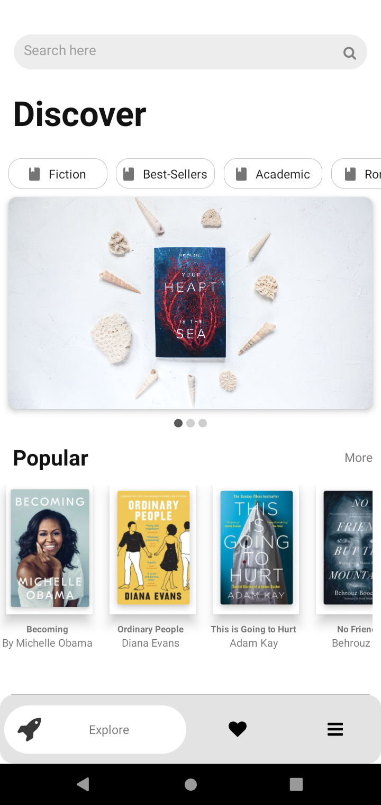
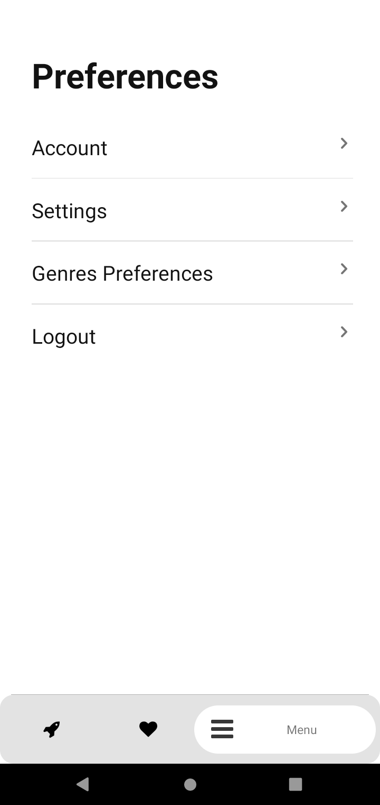

<h1 align="center">
    
</h1>

  

  

  

  

  <a href="#-project">Project</a>&nbsp;&nbsp;&nbsp;|&nbsp;&nbsp;&nbsp;
  <a href="#rocket-Technologies">Technologies</a>&nbsp;&nbsp;&nbsp;|&nbsp;&nbsp;&nbsp;
  <a href="#-layout">Layout</a>&nbsp;&nbsp;&nbsp;|&nbsp;&nbsp;&nbsp;
  <a href="#-how-to-use">My Next Steps</a>&nbsp;&nbsp;&nbsp;|&nbsp;&nbsp;&nbsp;
  <a href="#-how-to-contribute">How to contribute</a>&nbsp;&nbsp;&nbsp;|&nbsp;&nbsp;&nbsp;
  <a href="#memo-license">License</a>

## 💻 Project

Xbook is a app developed for book Lovers.
That aims to help you find your next book and save your favorites.

## :rocket: Technologies

This project was developed with the following technologies:

- [React][reactjs]
- [React Native][rn]

## 🔖 Layout

    
    
    

## :information_source: My Next Steps

- Fecth to Google Book API
- Connect to Firebase 
- Tests

## 🤔 How to contribute

- Make a fork;
- Create a branck with your feature: `git checkout -b my-feature`;
- Commit changes: `git commit -m 'feat: My new feature'`;
- Make a push to your branch: `git push origin my-feature`.

After merging your receipt request to done, you can delete a branch from yours.

## :memo: License

This project is under the MIT license. See the [LICENSE](LICENSE.md) for details.

Made with ♥ by Isaque Igor :wave: [Get in touch!](https://www.linkedin.com/in/isaqueigor/)

[reactjs]: https://reactjs.org
[rn]: https://facebook.github.io/react-native/